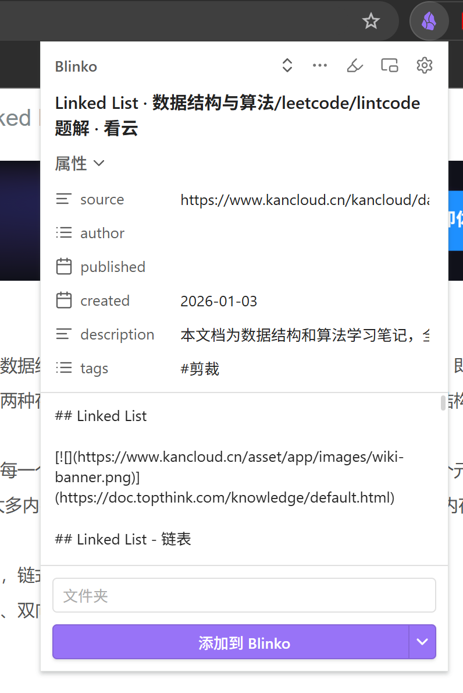
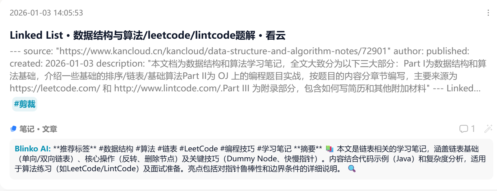
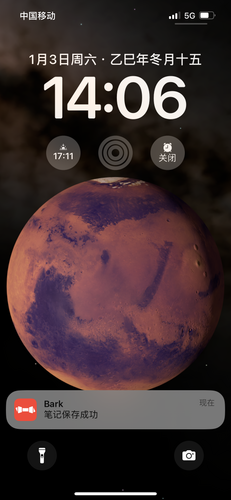
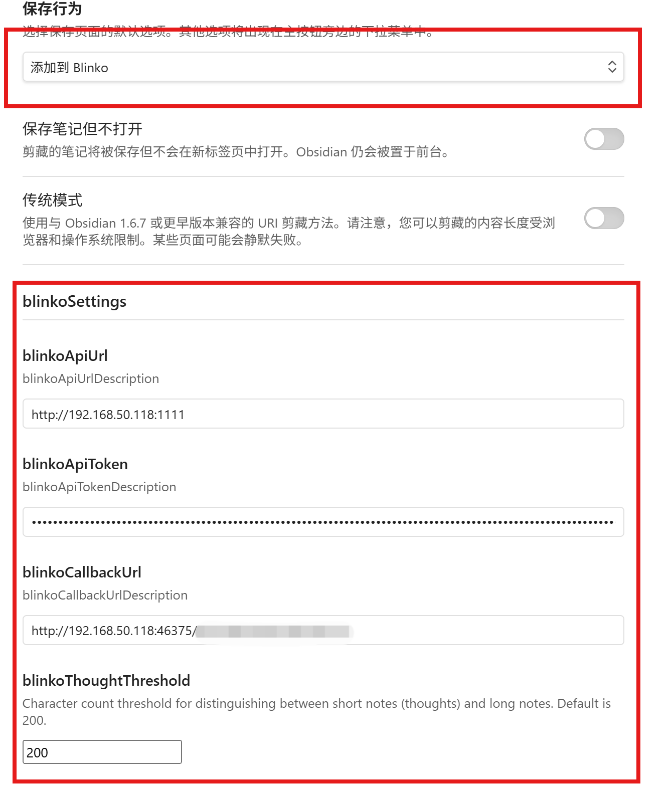
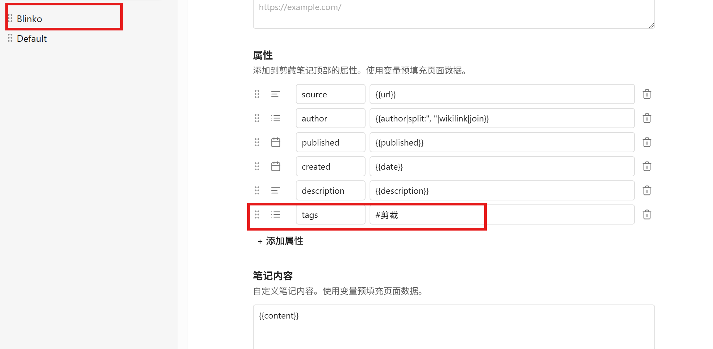

# Obsidian Web Clipper - Blinko 剪裁功能使用文档

* 剪裁功能截图



* 效果截图



* 消息通知截图



## 目录

- [功能简介](#功能简介)
- [安装扩展](#安装扩展)
- [配置 Blinko](#配置-blinko)
- [使用剪裁功能](#使用剪裁功能)
- [配置说明](#配置说明)

---

## 功能简介

在保留Obsidian Web Clipper原有功能的基础上
支持 Obsidian Web Clipper 将网页内容直接保存到 **Blinko** 笔记系统中。

### 主要特性

- ✅ 直接将网页内容保存到 Blinko
- ✅ 自动识别(闪念)和(笔记)
- ✅ 支持自定义 API 配置
- ✅ 支持 Markdown 格式输出
- ✅ 可选的回调通知功能

---

## 安装扩展

> **注意:** 本扩展会跟原生的Obsidian Web Clipper扩展冲突,请先卸载原生扩展。

### 本地安装扩展

#### release 版本安装
1. 下载安装文件: [release](https://github.com/zxdy/obsidian-clipper/releases/tag/v1.0.0-blinko)
2. 解压文件夹
3. 加载到浏览器:
	- **Chrome/Brave/Edge**: 打开 `chrome://extensions`,启用开发者模式,加载解压目录


#### 源代码安装

如果你想在本地开发或测试 Web Clipper:

1. 克隆代码仓库:
   ```bash
   git clone https://github.com/obsidianmd/obsidian-clipper.git
   cd obsidian-clipper
   git checkout blinko-clipper-master
   ```

2. 安装依赖:
   ```bash
   npm install
   ```

3. 构建扩展:
   ```bash
   npm run build:chrome
   ```

4. 加载到浏览器:
   - **Chrome/Brave/Edge**: 打开 `chrome://extensions`,启用开发者模式,加载 `dist` 目录

---

## 配置 Blinko

### 第一步: 打开设置页面

1. 点击浏览器工具栏中的 Obsidian Web Clipper 图标
2. 在弹出菜单中点击 **Settings** (设置) 按钮
3. 导航到 **General** (通用) 设置页面

### 第二步: 配置保存行为

1. 在 **General** 页面中找到 **Save behavior** (保存行为) 选项
2. 从下拉菜单中选择 **Add to Blinko**
3. 或者你可以在剪裁时通过主按钮旁的菜单选择不同的保存方式

### 第三步: 配置 Blinko API

1. 在 **General** 页面向下滚动到 **Advanced** (高级) 部分
2. 找到 **Blinko** 子部分
3. 填写以下配置:

| 配置项 | 说明 | 示例 |
|---------|------|------|
| **API URL** | Blinko 服务的基础域名地址(程序会自动拼接 API 路径) | `http://192.168.50.118:1111` |
| **API Token** | Blinko API 的认证令牌 | `eyJhbGciOiJIUzI1NiIsInR5cCI6IkpXVCJ9...` |
| **Callback URL** (可选) | 保存状态更新的回调通知地址 | `http://your-callback.com/notify` |
| **Thought length threshold** (可选) | 区分短笔记和长笔记的字符数阈值 | `200` (默认值) |

### 第四步: 配置模版

1. 从 **Default** 模版中复制一个模版到 **Blinko** 模版中
2. 修改模版内容,删除 title 属性，修改tags内容，添加 "#剪裁" 标签


**重要提示:**
- API URL 只需要填写域名和端口,不需要包含 `/api/v1/note/upsert` 路径
- 例如填写 `http://192.168.50.118:1111`,程序会自动拼接为 `http://192.168.50.118:1111/api/v1/note/upsert`

### 获取 Blinko API Token

1. 登录到你的 Blinko 实例
2. 进入 **Settings** (设置) → **访问令牌**页面
3. 复制 令牌 并粘贴到 Obsidian Web Clipper 的配置中

---

## 使用剪裁功能

### 基本使用流程

1. **打开要剪裁的网页**
   - 在浏览器中导航到你想要保存的网页

2. **启动 Web Clipper**
   - 点击浏览器工具栏中的 Obsidian Web Clipper 图标
   - 或使用键盘快捷键(需在浏览器扩展设置中配置)

3. **预览和编辑**
   - Web Clipper 会显示剪裁预览窗口
   - 你可以编辑笔记标题、内容、添加标签等
   - 可以选择不同的模板进行格式化

4. **保存到 Blinko**
   - 确认内容无误后,点击 **添加到Blinko** 按钮
   - 笔记会自动保存到 Blinko

### 笔记类型自动识别

Web Clipper 会根据笔记内容长度自动区分:

- **闪念**: 内容长度小于阈值(默认 200 字符)
- **笔记**: 内容长度大于等于阈值

你可以在设置中调整 **Thought length threshold** 来改变识别阈值。

### 剪裁选项

在剪裁窗口中,你可以通过主按钮旁的下拉菜单选择不同的保存方式:

- **Add to Blinko** - 保存到 Blinko
- **Add to Obsidian** - 保存到 Obsidian
- **Copy to clipboard** - 复制到剪贴板
- **Save file** - 保存为文件

---

## 配置说明

### API URL 格式

**正确格式:**
```
http://192.168.50.118:1111
https://your-blinko-instance.com
https://api.example.com:8080
```

**错误格式(不要包含完整路径):**
```
http://192.168.50.118:1111/api/v1/note/upsert  ❌
```

程序会自动在用户输入的基础上拼接 `/api/v1/note/upsert` 路径。

### API Token 安全提示

- API Token 相当于你的登录密码,请妥善保管
- 不要将 Token 分享给他人
- 如果 Token 泄露,请立即在 Blinko 中撤销并重新生成
- 建议定期更换 API Token

### 回调通知 (可选，推荐使用Bark)

如果你配置了 Callback URL,Web Clipper 会在保存笔记后发送通知:

**成功时:**
```
GET http://your-callback.com/笔记保存成功
```

**失败时:**
```
GET http://your-callback.com/笔记保存失败
```

---

## 故障排查

### 问题: 笔记保存失败

**可能原因:**

1. **API URL 配置错误**
   - 检查 URL 格式是否正确
   - 确保只包含域名和端口
   - 测试 Blinko 服务是否可访问

2. **API Token 无效**
   - 确认 Token 是否正确复制
   - 检查 Token 是否已过期
   - 尝试在 Blinko 中重新生成 Token

3. **网络连接问题**
   - 检查浏览器是否能访问 Blinko 实例
   - 如果使用局域网地址,确认设备在同一网络
   - 检查防火墙设置

4. **CORS 跨域问题**
   - 确保 Blinko API 支持跨域请求
   - 检查 Blinko 服务器的 CORS 配置

### 问题: 回调通知未收到

**解决方案:**

- 检查 Callback URL 是否可访问
- 确认 Callback 服务器正常运行
- 查看浏览器控制台的错误日志

### 问题: 笔记类型识别不正确

**解决方案:**

- 调整 **Thought length threshold** 值
- 查看保存的笔记类型是否符合预期
- 如果希望所有笔记都作为长笔记保存,将阈值设置为 0


---

## 高级功能

### 模板系统

虽然保存到 Blinko 不需要使用模板,但 Web Clipper 提供了强大的模板系统用于:

- 自定义笔记格式
- 添加元数据(YAML frontmatter)
- 使用变量提取页面信息
- 应用 CSS 选择器过滤内容

### 变量系统

可用的模板变量包括:

| 变量 | 说明 |
|-------|------|
| `{{title}}` | 页面标题 |
| `{{content}}` | 页面内容 |
| `{{url}}` | 页面 URL |
| `{{date}}` | 当前日期 |
| `{{published}}` | 发布日期(如果有) |

### 快捷键配置

在浏览器扩展设置中配置自定义快捷键:

1. 打开 `chrome://extensions/shortcuts` (Chrome/Brave)
2. 找到 Obsidian Web Clipper
3. 为各个操作配置快捷键

---

## 相关资源

- **[官方文档](https://help.obsidian.md/web-clipper)** - 完整的 Web Clipper 使用文档
- **[Blinko项目](https://blinko.space)** - Blinko 项目主页


---

## 许可证

Obsidian Web Clipper 遵循与主项目相同的开源许可证。

---

## 更新日志

### 最新版本

- ✨ 新增 Blinko 保存功能
- ✨ 自动识别笔记类型(短/长)
- ✨ 支持自定义 API 配置
- ✨ 可选回调通知功能
- 🐛 修复配置保存问题
- 🐛 修复 URL 自动拼接逻辑
